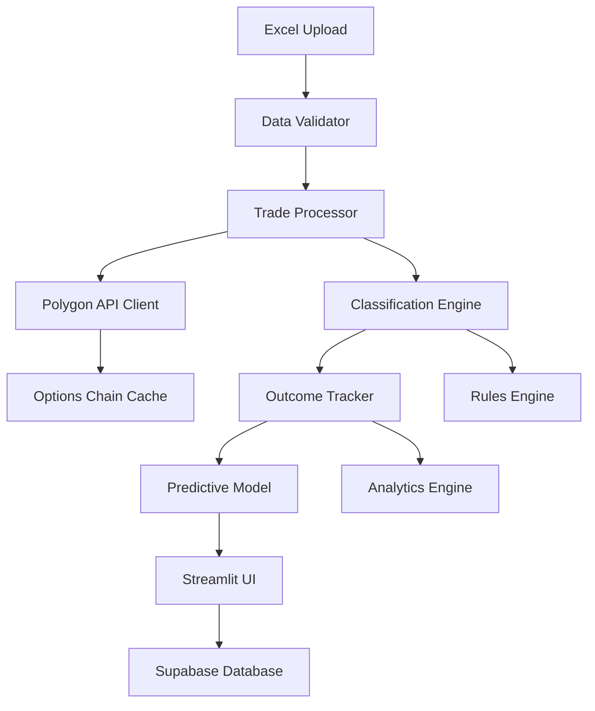

# Design Document

## Overview

The enhanced options flow classifier will transform the existing Streamlit application into a comprehensive multi-leg options trade analysis system. The design builds upon the current Supabase + Streamlit architecture while adding sophisticated classification logic, real-time options data integration via Polygon API, outcome tracking, and predictive modeling capabilities.

The system will process Excel uploads containing options flow data, systematically classify trades using market data and predefined rules, track outcomes against predictions, and provide analytical insights for trading decisions.

## Architecture

### High-Level Architecture



### Component Architecture

The application will be restructured into modular components:

1. **Data Layer**: Supabase integration with enhanced schema
2. **Processing Layer**: Trade classification and analysis logic
3. **External APIs**: Polygon API integration with caching
4. **Business Logic**: Rules engine and predictive modeling
5. **Presentation Layer**: Enhanced Streamlit interface

## Components and Interfaces

### Classification Types and Design Rationale

The system implements 11 distinct classification types based on strike relationships and market conditions:

1. **ATM SAME STRIKE**: Both legs have identical at-the-money strikes
2. **ITM SAME STRIKE**: Both legs have identical in-the-money strikes
3. **OTM SAME STRIKE**: Both legs have identical out-of-the-money strikes
4. **WITHIN RANGE OTMS**: Both legs within 0.18 delta range of buy side direction
5. **OUTSIDE RANGE OTMS**: Either leg outside 0.18 delta range
6. **BLANK SIDE**: Missing or null side values requiring manual review
7. **WITHIN RANGE ITMS**: ITM strikes on both sides within 0.18 delta range
8. **STRADDLE**: Simultaneous buy call and buy put positions
9. **NEGATIVE ITM**: Sell side aggregate value exceeds buy side value
10. **DEBIT AND SELL**: Debit spread combined with opposite sell leg
11. **UNCLASSIFIED**: Fallback for trades not matching any pattern

**Design Rationale**: The 0.18 delta threshold was chosen as it represents a meaningful boundary for options moneyness classification, providing sufficient granularity for trade analysis while avoiding over-segmentation. The classification system prioritizes strike relationships over premium values as strikes are more stable indicators of trade intent.

### 1. Data Models

#### Enhanced Trade Model
```python
@dataclass
class OptionsFlow:
    id: str #groups flows
    created_datetime: datetime
    symbol: str
    buy_sell: str
    call_put: str
    strike: float
    spot: float
    expiration_date: date
    premium: float
    volume: int
    open_interest: int
    price: float
    side: str
    color: str
    set_count: int
    implied_volatility: float
    dte: int
    er_flag: bool
    classification: str
    expected_hypothesis: str
    actual_outcome: Optional[str]  # Values: "Forever Discounted", "Discount then pump", "Forever Pumped", "Pump then discount"
    trade_value: float
    confidence_score: float
```

#### Options Chain Data Model
```python
@dataclass
class OptionsChainData:
    symbol: str
    expiration: date
    strike: float
    contract_type: str  # 'call' or 'put'
    delta: float
    gamma: float
    theta: float
    vega: float
    implied_volatility: float
    open_interest: int
    volume: int
    close: float
    timestamp: datetime
```

#### Classification Rule Model
```python
@dataclass
class ClassificationRule:
    rule_id: str
    name: str
    description: str
    classification_logic: Dict[str, Any]
    expected_hypothesis: str
    result_keywords: List[str]
    is_active: bool
    created_date: datetime
    success_rate: Optional[float]
```

### 2. Core Services

#### PolygonAPIClient
```python
class PolygonAPIClient:
    def __init__(self, api_key: str):
        self.client = RESTClient(api_key)
        self.cache = OptionsChainCache()
        self.yfinance_client = yf  # For spot price data

    def fetch_options_chain(self, symbol: str) -> Dict[str, OptionsChainData]:
        """Fetch and cache options chain data with exponential backoff retry"""

    def get_current_spot_price(self, symbol: str) -> float:
        """Get current spot price from yfinance for ATM determination"""

    def get_delta_for_strike(self, symbol: str, strike: float,
                           contract_type: str, expiration: date) -> float:
        """Get delta value for specific option"""

    def find_delta_strike(self, symbol: str, target_delta: float,
                         contract_type: str, expiration: date) -> float:
        """Find strike price closest to target delta"""

    def find_atm_strike(self, symbol: str, expiration: date) -> float:
        """Find ATM strike closest to current spot price"""

    def calculate_delta_range(self, symbol: str, expiration: date,
                            buy_side_direction: str) -> Tuple[float, float]:
        """Calculate 0.18 delta range boundaries for classification"""

    def is_api_available(self) -> bool:
        """Check if Polygon API is available, fallback to cache if not"""
```

#### TradeClassifier
```python
class TradeClassifier:
    def __init__(self, polygon_client: PolygonAPIClient, rules_engine: RulesEngine):
        self.polygon_client = polygon_client
        self.rules_engine = rules_engine

    def classify_multi_leg_trade(self, trades: List[OptionsFlow]) -> Tuple[str, str]:
        """Classify multi-leg options trade and return classification with expected hypothesis"""

    def classify_atm_same_strike(self, trades: List[OptionsFlow]) -> bool:
        """Check if both legs have same ATM strike"""

    def classify_itm_same_strike(self, trades: List[OptionsFlow]) -> bool:
        """Check if both legs have same ITM strike"""

    def classify_otm_same_strike(self, trades: List[OptionsFlow]) -> bool:
        """Check if both legs have same OTM strike"""

    def classify_within_range_otms(self, trades: List[OptionsFlow]) -> bool:
        """Check if both legs strikes are within 0.18 delta range of buy side direction"""

    def classify_outside_range_otms(self, trades: List[OptionsFlow]) -> bool:
        """Check if either legs strikes are outside 0.18 delta range"""

    def classify_blank_side(self, trades: List[OptionsFlow]) -> bool:
        """Check if side values are blank or none"""

    def classify_within_range_itms(self, trades: List[OptionsFlow]) -> bool:
        """Check if ITM strikes exist on both sides within 0.18 delta range"""

    def classify_straddle(self, trades: List[OptionsFlow]) -> bool:
        """Check if there is both a buy call and buy put"""

    def classify_negative_itm(self, trades: List[OptionsFlow]) -> bool:
        """Check if sell side aggregate value exceeds buy side"""

    def classify_debit_and_sell(self, trades: List[OptionsFlow]) -> bool:
        """Check if there is a debit spread with opposite sell leg"""

    def determine_strike_relationship(self, trades: List[OptionsFlow]) -> Dict[str, Any]:
        """Determine ATM/ITM/OTM relationships using current spot price"""

    def calculate_delta_range(self, symbol: str, buy_side_direction: str,
                            expiration: date) -> Tuple[float, float]:
        """Calculate 0.18 delta range for classification"""

    def validate_earnings_flag(self, trade: OptionsFlow) -> bool:
        """Enhanced earnings validation beyond Excel ER flag"""

    def classify_earnings_trade(self, trade: OptionsFlow) -> bool:
        """Classify trade as earnings-related based on ER flag and additional validation"""

    def get_expected_hypothesis(self, classification: str, is_earnings: bool) -> str:
        """Get expected hypothesis based on classification and earnings status"""
```

#### RulesEngine
```python
class RulesEngine:
    def __init__(self, supabase_client: Client):
        self.supabase = supabase_client
        self.rules_cache = {}

    def load_rules(self) -> Dict[str, ClassificationRule]:
        """Load classification rules from database"""

    def add_rule(self, rule: ClassificationRule) -> bool:
        """Add new classification rule"""

    def update_rule(self, rule_id: str, updates: Dict[str, Any]) -> bool:
        """Update existing rule with version tracking"""

    def evaluate_rule(self, rule_name: str, trade_data: Dict[str, Any]) -> bool:
        """Evaluate if trade matches rule criteria"""

    def reclassify_trades_with_new_rules(self, rule_id: str) -> int:
        """Re-classify existing trades when rules are updated"""

    def detect_rule_conflicts(self, new_rule: ClassificationRule) -> List[str]:
        """Detect conflicts with existing rules"""

    def resolve_rule_conflicts(self, conflicts: List[str], resolution: str) -> bool:
        """Resolve rule conflicts based on user choice"""

    def get_rule_effectiveness_metrics(self, rule_id: str) -> Dict[str, float]:
        """Get effectiveness metrics for a specific rule"""
```

#### OutcomeTracker
```python
class OutcomeTracker:
    def __init__(self, supabase_client: Client):
        self.supabase = supabase_client

    def record_outcome(self, trade_id: str, actual_outcome: str) -> bool:
        """Record actual trade outcome"""

    def calculate_accuracy_metrics(self, classification: str) -> Dict[str, float]:
        """Calculate accuracy for classification type"""

    def get_historical_performance(self, filters: Dict[str, Any]) -> pd.DataFrame:
        """Get historical performance data"""
```

#### PredictiveModel
```python
class PredictiveModel:
    def __init__(self, outcome_tracker: OutcomeTracker):
        self.outcome_tracker = outcome_tracker

    def predict_outcome_probability(self, classification: str,
                                  trade_value: float = None) -> Dict[str, float]:
        """Predict outcome probabilities with trade value consideration"""

    def analyze_earnings_success_rate(self) -> Dict[str, float]:
        """Analyze earnings trade success rates"""

    def generate_insights(self, query: str) -> Dict[str, Any]:
        """Generate predictive insights based on query with confidence intervals"""

    def get_low_value_trade_adjustments(self, trade_value: float) -> Dict[str, float]:
        """Calculate probability adjustments for trades under $100k"""

    def get_confidence_intervals(self, classification: str) -> Dict[str, Tuple[float, float]]:
        """Get confidence intervals for outcome predictions"""
```

### 3. Streamlit User Interface

#### UI Components for Enhanced Features
```python
class StreamlitUI:
    def __init__(self, classifier: TradeClassifier, outcome_tracker: OutcomeTracker,
                 predictive_model: PredictiveModel):
        self.classifier = classifier
        self.outcome_tracker = outcome_tracker
        self.predictive_model = predictive_model

    def render_excel_upload_interface(self) -> None:
        """Render Excel file upload with progress indicators and validation"""

    def render_classification_results(self, trades: List[OptionsFlow]) -> None:
        """Display classification results with confidence scores and expected hypotheses"""

    def render_outcome_tracking_interface(self) -> None:
        """Interface for recording and viewing trade outcomes"""

    def render_predictive_insights_query(self) -> None:
        """Query interface for predictive insights with confidence intervals"""

    def render_rule_management_interface(self) -> None:
        """Interface for adding, modifying, and viewing classification rules"""

    def render_accuracy_metrics_dashboard(self) -> None:
        """Dashboard showing classification accuracy and performance metrics"""

    def show_processing_progress(self, current: int, total: int, operation: str) -> None:
        """Display real-time processing progress for long operations"""

    def display_error_messages(self, errors: List[str]) -> None:
        """Display specific error messages with user guidance"""

    def show_duplicate_resolution_interface(self, duplicates: List[Tuple[int, int]]) -> None:
        """Interface for resolving duplicate trade detection"""
```

### 4. Data Processing Pipeline

#### Excel Data Processor
```python
class ExcelDataProcessor:
    def __init__(self, validator: DataValidator):
        self.validator = validator

    def process_upload(self, file_path: str) -> Tuple[List[OptionsFlow], List[str]]:
        """Process Excel upload and return trades and errors"""

    def validate_columns(self, df: pd.DataFrame) -> List[str]:
        """Validate required columns exist"""

    def clean_and_transform(self, df: pd.DataFrame) -> pd.DataFrame:
        """Clean and transform raw Excel data"""

    def detect_duplicates(self, trades: List[OptionsFlow]) -> List[Tuple[int, int]]:
        """Detect duplicate trades and return index pairs"""

    def handle_missing_data(self, df: pd.DataFrame) -> Tuple[pd.DataFrame, List[str]]:
        """Handle missing or invalid data with specific error messages"""

    def show_processing_progress(self, current: int, total: int) -> None:
        """Display processing progress to user"""
```

## Data Models

### Database Schema Extensions

#### Enhanced options_flow table
```sql
CREATE TABLE options_flow (
    id UUID PRIMARY KEY DEFAULT gen_random_uuid(),
    created_datetime TIMESTAMP WITH TIME ZONE,
    symbol VARCHAR(10) NOT NULL,
    buy_sell VARCHAR(4) NOT NULL,
    call_put VARCHAR(4) NOT NULL,
    strike DECIMAL(10,2) NOT NULL,
    spot DECIMAL(10,2) NOT NULL,
    expiration_date DATE NOT NULL,
    premium DECIMAL(12,2),
    volume INTEGER,
    open_interest INTEGER,
    price DECIMAL(10,2),
    side VARCHAR(1),
    color VARCHAR(20),
    set_count INTEGER,
    implied_volatility DECIMAL(6,4),
    dte INTEGER,
    er_flag BOOLEAN,
    classification VARCHAR(50),
    expected_hypothesis TEXT,
    actual_outcome VARCHAR(50),
    trade_value DECIMAL(15,2),
    confidence_score DECIMAL(4,3),
    created_at TIMESTAMP WITH TIME ZONE DEFAULT NOW(),
    updated_at TIMESTAMP WITH TIME ZONE DEFAULT NOW()
);
```

#### New classification_rules table
```sql
CREATE TABLE classification_rules (
    rule_id UUID PRIMARY KEY DEFAULT gen_random_uuid(),
    name VARCHAR(100) UNIQUE NOT NULL,
    description TEXT,
    classification_logic JSONB NOT NULL,
    expected_hypothesis TEXT NOT NULL,
    result_keywords TEXT[] NOT NULL,
    is_active BOOLEAN DEFAULT true,
    success_rate DECIMAL(5,4),
    created_date TIMESTAMP WITH TIME ZONE DEFAULT NOW(),
    updated_date TIMESTAMP WITH TIME ZONE DEFAULT NOW()
);
```

#### New options_chain_cache table
```sql
CREATE TABLE options_chain_cache (
    id UUID PRIMARY KEY DEFAULT gen_random_uuid(),
    symbol VARCHAR(10) NOT NULL,
    expiration_date DATE NOT NULL,
    strike DECIMAL(10,2) NOT NULL,
    contract_type VARCHAR(4) NOT NULL,
    delta DECIMAL(8,6),
    gamma DECIMAL(8,6),
    theta DECIMAL(8,6),
    vega DECIMAL(8,6),
    implied_volatility DECIMAL(6,4),
    open_interest INTEGER,
    volume INTEGER,
    last_price DECIMAL(10,2),
    bid DECIMAL(10,2),
    ask DECIMAL(10,2),
    cached_at TIMESTAMP WITH TIME ZONE DEFAULT NOW(),
    UNIQUE(symbol, expiration_date, strike, contract_type)
);
```

## Error Handling

### API Error Handling
- Polygon API rate limiting with exponential backoff
- Fallback to cached data when API unavailable
- Graceful degradation for missing options data
- Comprehensive logging for debugging

### Data Validation Errors
- Excel format validation with specific error messages
- Missing column detection and user guidance
- Data type validation with correction suggestions
- Duplicate trade detection and resolution options

### Classification Errors
- Fallback classification for unmatched patterns
- Confidence scoring for uncertain classifications
- Manual review flagging for edge cases
- Rule conflict resolution mechanisms

## Testing Strategy

### Unit Testing
- Individual component testing for all services
- Mock external API dependencies
- Data validation logic testing
- Classification rule evaluation testing

### Integration Testing
- End-to-end Excel processing pipeline
- Polygon API integration testing
- Supabase database operations
- Multi-component workflow testing

### Performance Testing
- Large dataset processing performance
- API rate limiting behavior
- Database query optimization
- Streamlit UI responsiveness

### User Acceptance Testing
- Excel upload workflow validation
- Classification accuracy verification
- Predictive model output validation
- UI/UX testing for all features

## Security Considerations

### API Security
- Secure API key management via Streamlit secrets
- Rate limiting compliance
- Error message sanitization

### Data Security
- Input validation and sanitization
- SQL injection prevention
- Secure file upload handling
- User session management

### Database Security
- Row-level security policies
- Encrypted connections
- Audit logging for sensitive operations
- Backup and recovery procedu
